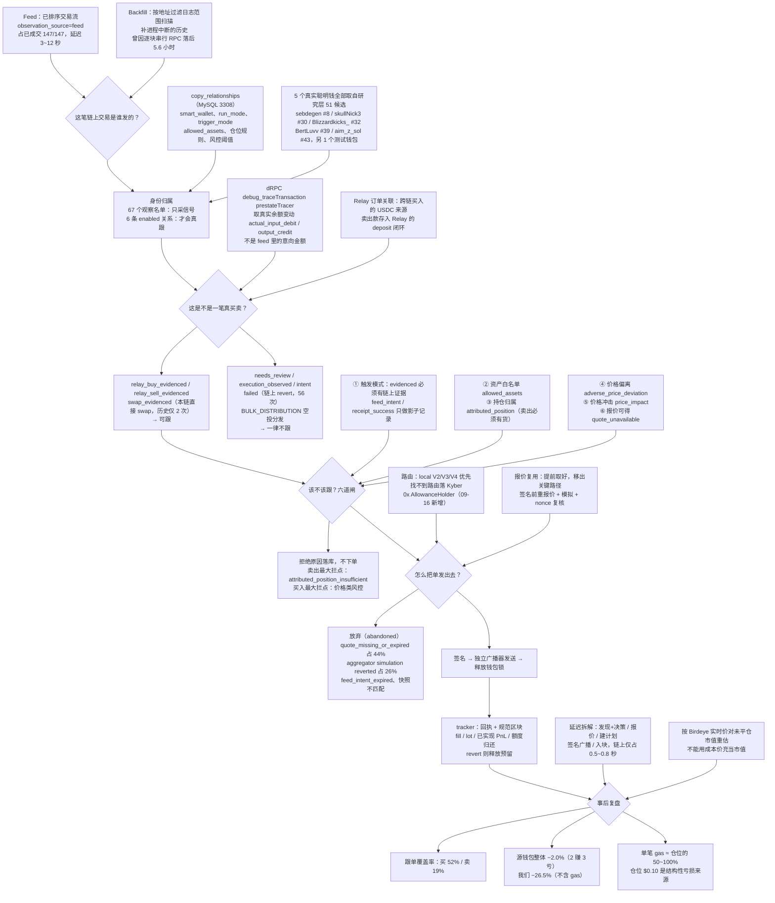

# 一笔聪明钱交易，如何走到我们的跟单成交

和 [copy_trade_flow.md](copy_trade_flow.md) 的区别：那份是**架构与执行顺序**（代码怎么跑），
这份是**问题驱动的生命周期**（一笔交易要闯过哪些判断），仿 `fomo_wallet_research/README.md` 的写法。

图中数字为 2026-09-13 ~ 09-16 实测，口径见文末。

## 口径与关键结论

**为什么必须等链上证据**：147/147 已成交订单的金额都来自 prestate trace 的真实余额变动。
feed 只负责**发现**，RPC 负责**确认与计量**。5,696 条信号里「从未上链」**0 条**、
「上链但 revert」1.14% —— 所以这道等待买的不是「防未上链」，而是**分类与计量能力本身**：
82% 的信号是空投、授权、转账、待复核，没有 trace 就分不出哪些是真买卖。

**延迟不是主要矛盾**：09-13 的 13 秒 → 09-16 的 3 秒，而告警到见顶的中位是 44 分钟。
真正决定盈亏的是下面三条。

**三个未解决的结构性问题**：
1. **只买不卖** —— 买入覆盖 52% 导致一半仓位我们没有，他们卖时 `attributed_position_insufficient`。
   源钱包靠卖出回收买入的 62%，我们只回收 44%，这是 24 个百分点收益差的主因。
2. **跟单权重与研究评分脱节** —— 主仓压在 BertLuvv（−18.7%），而 +20% 的 sebdegen（研究 #8）跟得最少。
3. **仓位 $0.10 扛不住 gas** —— gas 每笔恒定约 0.0000232 原生币，与仓位大小无关。

**易错点**：Kyber / 0x AllowanceHolder 是**路由合约不是人**；
观察名单 67 ≠ enabled 关系 6；`relay/1` 路径的 `smart_wallet_label` 为 NULL 但归属没丢。
