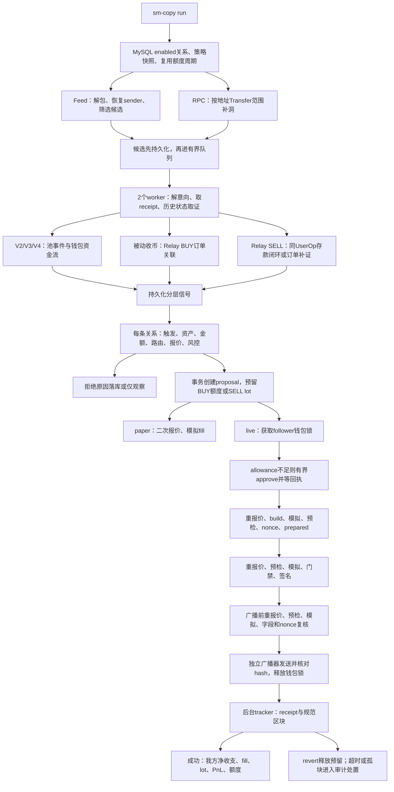

# Robinhood 聪明钱跟单：实际流程、识别规则与延时优化

核对日期：2026-09-14；代码基线：`c27810c821f13f1276df1d81ef6c82879a37b9af`。

本文按当前源码、后台日志、业务 MySQL 和公开链上回执重写。本次只读调查、离线测试和文档修改，
没有重启进程、修改策略、访问私钥库、授权或发送交易。早期 README、COPYTRADING_PLAN、HANDOFF 的
M1/M2 描述是历史记录；当前已有独立门禁控制的 live 链路。运维操作见
[OPERATOR_RUNBOOK.md](OPERATOR_RUNBOOK.md)。本文描述现状，不扩大操作授权。

结论：10 秒以上延时可以从账本复现。优先处理候选协程被执行链路占住、无订单入账反复查 Relay、
多轮串行报价和 RPC 检查。现有证据不足以把主要耗时归咎于出块、签名计算或服务商。

开发进展追加：已有独立、默认关闭的 Feed 影子采集，记录识别/归属、业务及 race 部署代码快照，
未接入本文生产流程，市场/准备采集仍未实现。race 包装器已完成固定字节码离线行为测试，
109 笔 Feed 包装 BUY 的参数与事后历史代码核验均通过；历史原始输入可复用，完整提前条件需区分已存摘要与完整时点证据，不能报提前下单成功。详见
[影子采集范围与操作](HOWTO_REPLAY_EARLY_FEED.md#独立实时影子采集首版识别与归属)。

## 1. 对原流程的修正

| 原表述 | 当前核对结果 |
|---|---|
| “97% 是 Fomo BUY、USDG 经 Kyber 跟买” | 未给时间和分母。本次累计 152 个 confirmed swap attempts 中，Kyber BUY 113、Kyber SELL 23；127 个 BUY 中 Kyber 占 88.98%。不能沿用 97%。 |
| Solver 从库存转币 | 只是可能路径。样本 A 的来源 receipt 有 3 个已识别 Swap；对聪明钱仅见 Token 净入账，不能把这 3 个 Swap 都归给它。 |
| 排序、执行、出块、Feed 推送同时发生 | Feed 是排序消息入口，执行结果仍要 receipt。节点可见时间不同，Feed 时间戳也不是本机接收时间。 |
| 被动收币都是 EXTERNAL_DELIVERY_CANDIDATE | receipt 无已识别 Swap 时是 INCOMING_TRANSFER，有 Swap 时才是 EXTERNAL_DELIVERY_CANDIDATE，两者都先 needs_review。 |
| Relay 证明源付款与目标钱包同一人 | BUY 检查 payer=订单 user、recipient=目标钱包，允许跨链地址不同；未独立证明两地址由同一人控制。 |
| 先查本地池，再做决策 | receipt 内路径发现发生在 worker；四档 fee 主动查池发生在 PaperEngine 决策内部，不能重复计时。 |
| 本地不可用就走 Kyber | 需关系启用 kyber 且路由选择失败；已经选到本地路径但报价失败时，不保证继续回退 Kyber。 |
| 四轮报价 | 四轮各含完整额与参考额；build 前额外完整额 routes，共 9 GET + 1 POST，不含 shadow/重试。 |
| 签名耗时约 2 秒 | 包含重报价、余额/nonce 预检、模拟、关系门禁、签名与落库；无纯签名 CPU 埋点。 |
| 广播后下一块必包含 | 返回 hash、入块、执行成功、规范链核对和结算是不同状态，不保证下一块包含。 |
| 每秒查一次，1–2 秒结算 | tracker 立即查，未终止才 sleep 1 秒；周期还包括 RPC，最多 180 轮而非严格 180 秒。 |
| SELL 是 BUY 反过来 | 按本关系归因 lot 的来源持仓比例映射，卖回原本金资产；可能另需 Token approve，不复制源跨链退出。 |

Feed 的排序语义及 `header.blockNumber` 是 L1 而非 L2 高度，见
[Nitro 官方文档](https://docs.arbitrum.io/run-arbitrum-node/sequencer/read-sequencer-feed)。
本项目不把 sequenceNumber 通用地当成 L2 高度。

## 2. 架构和实际执行顺序



### 2.1 配置和并发

`run` 固定使用 MySQL 配置/账本、Relay 自动关联、自动复用额度周期。监听集合是 CSV 与 enabled
relationship 的 smart wallets 的并集；补洞只扫描当前配置的 smart wallets，没有配置才用全名单。
名单标签是导入/人工配置，不是算法算出的“聪明钱盈利认证”。

同一信号通过 `safe_paper_observe()` 并发分发给多条关系。各关系独立报价、预留和归因；相同 follower
的授权至广播持有同一把进程内钱包锁，不同 follower 可并行。

**当前 worker 会 await 整个决策/执行直至广播；广播后的 tracker 才脱离 worker。**
worker 随后还会运行 receipt_success shadow，再处理后续信号或候选。默认 workers=2，队列容量256；
所有组件共享的 ReadOnlyRpc 并发上限4。RPC/Relay/Kyber 用 to_thread 执行 HTTP；
PyMySQL 账本和关系门禁仍为同步调用，会阻塞事件循环。每笔执行内部有大量串行 await。

实盘逐关系校验 enabled、mainnet_live、确认时间不早于配置更新时间、快照与 key 元数据，
签名及广播前再查关系/急停。ReadOnlyRpc allowlist 没有广播方法；发送由独立 MainnetBroadcaster 完成。
`copy_eligible=false` 表示观察层不授予交易许可，不能据此推断 live 分支不会交易。
进程内锁不能保护重复实例，不能直接再开相同 follower 的任务来“加速”。

### 2.2 Feed、补洞与持久重试

1. Feed JSON v1 → Base64 l2Msg → Nitro kind3递归拆包/kind4原始签名交易。
2. RLP 解 legacy/type1/2/4，检查 chain ID4663，恢复 sender、计算 tx hash。
3. 默认消息最大年龄3秒、静默5秒；重复序列忽略，缺口/畸形消息告警重连。
4. `relevant()` 要求 sender 命中，或 calldata 含观察地址字节；后者**只扩大候选，不证明身份**。
5. `put_candidate()` 先落盘，按 tx hash 去重，再由 dispatcher 领取，250ms兜底唤醒。
6. 补洞用 latest-2 的 safe head，一轮最多2000块，查 Transfer 的 from/to topics，只拉命中交易和所需头部。
   不是旧文所述逐块取完整交易列表。结果超限/请求拒绝会拆分范围；隐藏状态、未知事件或其他链订单不保证覆盖。
7. backfill 初始 fresh=false，不重建原 Feed 接收时间。范围起点核对旧游标父哈希，命中块/末端保存头部；
   **没有逐块核对整个范围**。自动共同祖先搜索为 max(64, backfill_batch+1)，默认2001块；找不到则停扫。
   日志 backfill_blocks 由 progress 回调累加，不能直接当作实际推进块数。
8. worker 先用 latest 委托代码解意向，再取 receipt，用交易前 prestateTracer 重解账户身份；
   需要时再做池验证和 native 差分。当前 wallets 为空也会执行一次账户 trace。
9. 单次 `rpc.receipt()` 最多8次空回执轮询、间隔250ms；候选最多领取8次，持久退避为
   2/4/8/16/32/60/60秒。Relay 空结果也走相同重试，并重跑整个 worker。

RelayNotReady 只表示 API 当前无订单，无法区分“未索引”和“普通转账本来无订单”。
重试耗尽的 candidate failed 不表示链上交易 revert。重组保留原 Feed 意向，撤销规范证据并重核候选；
已发送的跟单不能因源交易重组自动撤回。

## 3. 哪些数据被识别为聪明钱交易

必须分清：**地址被观察 → 行为可归属 → 满足该关系跟单条件**。

### 3.1 身份与 ABI

| mode | 身份来源 | 支持边界 |
|---|---|---|
| direct | 签名恢复 sender 命中 | 已登记合约和支持方法；不是同 selector 都可信 |
| self_account | sender命中且调用自身 | 已知 Simple7702Account/MetaMask 委托实现 |
| bundled_account | 已知 EntryPoint handleOps 的 UserOperation.sender | 保存 userop_index/nonce/path，bundler不是用户 |
| third_party | 无主动已解信号时，receipt收款人命中 | 先是收币候选，不伪造目标 Feed 意向 |

关键常量见 [registry.py](../src/smart_money/registry.py)，解析见 [decode.py](../src/smart_money/decode.py)。

| 层级 | selector | 用途 |
|---|---|---|
| EntryPoint | 0x765e827f | packed UserOperations |
| Simple7702Account | 0xb61d27f6 / 0x34fcd5be | 单调用/批调用 |
| MetaMask Account | 0xe9ae5c53 | 已支持模式的单/批调用 |
| Relay Proxy / Router | 0xf9e4bab4 / 0xcd6e13f7 | 递归 Relay 子调用 |
| Relay cleanup | 0x73b7bb2f | 关联资产、目标、payload、minimum |
| Depository | 0xe8017952 / 0x5a1ee3ac / 0x49290c1c | 固定额/回执给出全额/native存款 |
| 0x AllowanceHolder | 0x2213bc0b | 聚合器输入意向，需关联唯一Relay SELL |
| Kyber Router | 0xe21fd0e9 | 聚合描述，需关联唯一Relay SELL |
| Universal Router | 0x3593564c / 0x24856bc3 | V2/V3/V4 command与settlement |
| RIPE Claim | 0x815a4392 | CLAIM |
| ERC-20 / WETH | 0x095ea7b3 / 0xa9059cbb / 0xd0e30db0 / 0x2e1a7d4d | approve/transfer/wrap/unwrap |

样本A顶层是 Relay Proxy 的 0x0a2b8f36，未在主动 ABI 支持列表中；通过收款候选、receipt 和订单仍能形成
BUY。这不代表已完整解码该 selector。

2026-09-14 对样本A追加了[离线参数解析](feedback/relay_0a2b8f36_decoded_2026-09-14.json)，
未改变运行时解码器：`0x0a2b8f36` 对应 `permit2TransferAndMulticall`，
顶层ABI重新编码与原始参数前缀一致。Permit2的 `user` 是Relay solver，不是聪明钱地址；
本链付款参数是 `347809641` raw USDG。三个子调用依次为approve、`0x998b5942`换币包装调用、
`cleanupErc20s`。最后一个子调用明确指定目标Token和聪明钱收款人，金额参数0表示转出Router
全部该Token余额，而非0到账。`refundTo`是原生币退款地址，`nftRecipient`是NFT收款地址，
二者不能替代ERC-20最终收款字段。

因此Feed输入已经能提供“换币并向聪明钱交付”的候选信息，并提前取出订单查询键：末尾额外32字节
与样本orderId相同；嵌套extra的UTF-8文本与requestId相同；它们都不等于顶层metadata。
`0x998b5942` 的固定字节码版本现已通过离线 EVM 行为测试：试跑各路线、选优执行、失败回退且
保留最低输出保护。源码仍未验证；三段候选路线不能当作三笔成交。生产识别路径未切换；
新增适配仅用于独立提前评估，要求当时部署代码匹配。参数和证据见 [race 规则](EARLY_FEED_REFERENCE.md#21-race-包装器验证范围与参数)。
候选不等于钱包自主下单或已确认BUY。最终数量、实际采用路线和源链付款关联仍需另行取证。
复现：`.venv/bin/python scripts/inspect_relay_permit2.py data/relay_0a2b8f36_sample_a_2026-09-14.json`。

`side()` 以 native ETH/WETH/USDG 为报价资产：报价币→其他Token为BUY，反向为SELL，其余TOKEN_SWAP。
这只是解码行为；其他Token互换通常没有本金桶，稳定币互换也不保证通过策略。raw用整数计算、
十进制字符串保存，不靠token名称判断。

### 3.2 证据状态

| 状态 | 可以说明 | 不能说明 |
|---|---|---|
| intent / intent_status=observed | 主动调用可解码 | 执行成功、净成交 |
| execution_status=success | 外层或目标UserOp成功 | allow-failure子调用全成功 |
| swap_evidenced | 支持路径的池事件与钱包收支对应 | 全协议覆盖、最终性、利润 |
| relay_buy_evidenced | Relay源订单与本地交付匹配 | 源链回执已独立复核、跨链地址同控制人 |
| relay_sell_evidenced | 支出与Relay存款闭合或订单补证 | USDG留在钱包、目标链独立确认 |
| needs_review / UNKNOWN | 缺证据或未支持 | 证明没有发生兑换 |
| canonical_status | unconfirmed/safe_head_confirmed/orphaned | 替代意向或执行状态 |

BUY/relay_buy_evidenced 可以保留 intent_status=not_attributed：本机没有目标主动发单的Feed意向。
UNKNOWN 的 stage 也可能是 execution_observed，不能单看 stage。任何这些状态都不表示 L1 finality。

### 3.3 直接 V2/V3/V4 的严格路径

[receipts.enrich()](../src/smart_money/receipts.py) 核对receipt tx hash、拒绝removed logs并检查status。
bundle按已知EntryPoint的 BeforeExecution/UserOperationEvent、wallet及nonce唯一隔离日志，
外层成功而目标UserOp失败仍为failed。

随后要求：

- V2/V3在receipt区块验证factory/pool代码、工厂映射及资产，匹配池Swap数量精确一致。
- V4核对PoolManager、PoolId/PoolKey、登记hook历史代码及settlement payer/recipient。
- 同(wallet,userop_index)仅一个交易行为、无UNKNOWN子调用；额外Swap导致不唯一时拒绝升级。
- ERC-20以该作用域Transfer净差为准，输入负、输出正；native需state-diff和可归属Gas剥离。
  bundled不能套用外层Gas，当前只有受限V4金额对应能闭合。
- 实际净额写入 actual_input_debit_raw/actual_output_credit_raw，不用calldata最大值冒充成交量。

claim与swap保留为独立子动作：不跟claim，但不丢弃后续能闭合的swap；不能因收款人数多就丢整个bundle。
这些是当前具体证据规则，不代表完整审计了代币经济行为。

### 3.4 Relay被动BUY：普通收币如何排除

仅当enrich没有主动signals且外层成功时，才额外分析被动收款。已有主动signals的混合交易，其他收款人不一定
另产信号，这是覆盖边界。无Swap记INCOMING_TRANSFER，有Swap记EXTERNAL_DELIVERY_CANDIDATE。

**2026-09-15 追加：直接转账跳过入账补证（代码已实现，需重启加载）。**
开启 Relay 自动关联时，在原始入账信号入库及查询订单前，使用已有 calldata/receipt 作本地判断，
不增加 RPC。`receipts.direct_token_transfer_evidence()` 只有以下条件全部满足才返回跳过依据：

- 顶层直接调用收到的代币合约，value=0，标准 `transfer(address,uint256)`（`0xa9059cbb`）
  或 `transferFrom(address,address,uint256)`（`0x23b872dd`），参数严格为 68/100 bytes，地址编码合法。
- 同一交易的成功回执恰好一条标准 ERC20 Transfer，token、from、to、正数 amount 逐项匹配，
  to 为当前信号钱包；transfer 的 from 取 tx.sender，transferFrom 的 from 取参数 owner，
  不是 operator。排除零地址转出/转入、自转账、removed 日志。
- 其他日志只允许同一代币的标准 Approval。多个 Transfer、金额不符、未知/畸形日志、Swap、
  Relay 交付事件、包装/批量/未知调用均保留原查询行为；不按 selector 单独过滤。

匹配时保持 `INCOMING_TRANSFER/needs_review` 和 `copy_eligible=false`，在现有 signals.evidence 中保存：
`relay_lookup_skipped=true`、`relay_lookup_skip_reason=direct_token_transfer`、
`relay_lookup_skip_evidence={rule,selector,token,sender,recipient,amount_raw,provenance}`。
rule 为 `direct-token-transfer-v1`，amount_raw 为十进制字符串，provenance 为
`transaction_calldata_and_receipt`。不删除 candidates/signals，不新增完整原始回执归档或数据库表。

跳过的信号不产生 Relay 查询/重试；整笔交易没有其他待补证信号时按原流程 complete 并保存 inclusion。
任务 complete 表示处理完成，不代表收币已证明为买入。旧 pending/retry 自然调度时适用新规则，
不批量重写历史、不重置 attempts、不重新激活 failed。离线 `relay-associate` 仍可用保存的订单文件
作严格人工补证。日志事件及 health counter 均为 `relay_lookup_skipped`；counter 是进程内跳过处理
次数，同一交易因其他信号重试可重复计数，不能当去重交易数。数据库统计应按 tx_hash/event_id 去重。

这是用户接受的查询过滤策略，不是“绝无购买”的证明：没有任何可识别标记的跨链直接转币履约也可能
被跳过。Feed 提前 BUY/SELL 本来就要求受支持买卖意向及归属，普通转账不满足；这次不改变该入口，
也不改变 receipt SELL 补证或交易执行门槛。主要减少补证负担，现场提速需上线后独立测量。

未命中上述过滤时继续查询订单，以下严格关联条件保持不变。

`relay_passive_buy()` 必须全部通过：

1. 本地候选成功，钱包净变化中只有一种正向Token credit。
2. requests/v2?hash=目标交易&includeOrderData=true&limit=2 恰好返回一个success request。
3. requestId/orderId格式有效且不混用；recipient等于Robinhood钱包。
4. origin有正输入量、源链/币/tx/付款人；payer=订单user，inTxs中源链/hash/success唯一命中。
5. 目标outTxs与settlement fills都唯一命中本候选chain/hash；outTx目标token/raw净入账与本地receipt完全相等。
6. orderData.output.payments恰好一项向该钱包交付该token，且0<minimumAmount<=实际入账。
   minimum不是要求等于到账量。

通过才升级BUY/relay_buy_evidenced、protocol=relay_solver。源链付款仍依赖Relay API，未独立核验源链receipt。
源payer可以与目标地址不同，没有独立的跨链同一人证明。多request、多正向币、多匹配payment均拒绝。

只有登记的(Solana chainId=792703809, USDC mint)映射为本地USDG，raw均六位小数。
这不是任意跨链币种自动汇率转换。Base ETH/WETH不自动用USDG规则出资；
[ETH出资改用USDG设计](ETH_FUNDED_TRADES_AS_USDG_DESIGN.md)仍是提案。

### 3.5 Relay SELL：卖币后存入结算币

主动解码在同wallet/UserOp/Relay根路径中找恰好一个0x或Kyber输入、一个cleanup deposit。
deposit recipient必须是该钱包、币种USDG、cleanup token一致；Kyber recipient还须为Relay Router。
未关联调用保持UNKNOWN，不是任意聚合器BUY/SELL都支持。

回执要求唯一Depository事件匹配orderId、钱包、资产、金额；全额方法从事件取实际量。
Token净支出为正且等于声明输入；同组仅一个trade、无UNKNOWN，并存在已识别Swap才升级relay_sell_evidenced。
这里 actual_output_credit_raw 沿用的是**USDG存入Depository数量**，另存actual_output_deposit_raw，
不是聪明钱USDG余额增加。

未闭合时可查源hash的多个Relay订单，以orderId唯一选择，再逐项核对user/metadata.sender、卖出Token/数量、
本地debit、源链/tx、Depository/存款币/金额；钱包不得有其他非零ERC-20净变化，inTxs须是唯一成功源交易，
目标payout metadata须有效。通过 `relay_confirmed_sell()` 才补证SELL。
没有要求目标recipient等于原EVM地址，没有“固定Solana地址表”匹配，也未独立查目标链outTx/fill。

Pons topic 0x8113d738abdcb6b38357e9d53a54a7157861a09031b453651f0fe7fe151f59df 已加入receipts.SWAPS；
这是源事件识别，不是Pons执行器或完整factory验证。Relay SELL的事件存在性规则弱于直接V2/V3/V4池验证，
文档不能把两类证据说成相同强度。

## 4. 不跟单的具体情形

| 情形 | 当前结果/典型reason | 动作 |
|---|---|---|
| 未命中观察sender/calldata | Feed不建候选，Transfer补洞可能补入 | 不执行 |
| calldata只出现地址 | 仅扩大候选 | 等归因 |
| 普通收币、无唯一订单 | INCOMING_TRANSFER/needs_review | 不买 |
| receipt有别人Swap，目标只收币 | EXTERNAL_DELIVERY_CANDIDATE | 不用别人Swap推断BUY |
| 大规模等额被动分发 | BULK_DISTRIBUTION一条汇总 | 不买 |
| 转账、claim、approve、wrap/unwrap、LP、单独存款 | 对应非交易行为 | 不复制；保留后续swap |
| 未支持selector/账户/子调用，作用域不唯一 | UNKNOWN/needs_review | 不猜测 |
| 目标UserOp或外层失败 | failed/reverted | 不执行 |
| 池/hook/settlement/资金流未闭合 | verification reason/needs_review | 不执行 |
| 已证实交易但无enabled关系 | 只存观察信号 | 不执行 |
| 协议不准入 | protocol_not_allowed | 拒绝 |
| 本金/结算币/已解析中间币不可信 | asset_not_allowed | 拒绝 |
| 只有意向/普通回执，live需evidenced | confirmed_exchange_evidence_required等 | shadow不占额度 |
| 路径不唯一/报价API失败/金额太小 | quote_unavailable，细因在payload.quote_error | 拒绝 |
| 报价过期/偏离/冲击/Gas超限 | quote_missing_or_expired等 | 拒绝 |
| BUY剩余额度不足 | budget_limit_exceeded | 整笔拒绝，不自动缩量 |
| SELL无本关系lot/来源持仓基数缺失 | attributed_position_insufficient/source_position_basis_missing | 不卖其他来源资产 |
| 本金/退出路径不唯一 | attributed_principal_asset_ambiguous/attributed_buy_execution_route_ambiguous | 拒绝 |
| source orphaned | source_signal_orphaned或后续门禁 | 不新建执行 |
| 急停/禁用/快照变化/nonce余额授权模拟失败 | 执行报错或live_execution_abandoned | 不继续发送，状态不明需审计 |

批量分发需同时满足：无主动signals、单Token、单发送人、至少100个不同收款人、等额、发送人不在观察名单、
无已识别Swap。不满足这些条件不等于购买，只是继续候选/未知。
[bulk_distribution.json](../data/bulk_distribution.json)有230个收款人、32个观察地址，回归要求一条汇总。

allowed_assets是可信本金和中间币集合，不是meme白名单。成功evidenced BUY目标/SELL来源Token动态放行；
对动态目标本地路径，代码不要求每个新池事先存在allowed_routes。
Kyber内部executor calldata不透明，不能声称逐跳验证了其所有中间资产。

**fresh仅用于feed_intent门槛；evidenced目前没有独立来源最大年龄门禁，也不强制等待safe_head_confirmed。**
历史backfill即使不新鲜，证据和当前报价通过仍可能进入执行。若要求过期BUY仅观察，需另实现规则，
不能假设已有。quote新鲜也不等于source新鲜。

## 5. 金额、路径、额度与跟卖

BUY按输入资产选择USDG或ETH_WETH桶。固定规则取fixed_amount_raw；
比例规则为floor(actual_input_debit_raw×ratio_ppm/1_000_000)，缺实际输入拒绝。
可用额度=limit-invested-reserved；当前Store超额整笔拒绝，不是早期方案的min裁剪。

路径顺序：已支持的本地来源路径，或配置/receipt验证的唯一匹配路径；
Relay BUY还可在登记V3 factory的100/500/3000/10000四档直接池中，按本笔实际输入报价择优；
路由选择失败后使用已启用Kyber。不遍历所有DEX比价，不重播聪明钱calldata。
找到本地路径之后的报价失败，不在路由选择函数的回退范围内。

SELL只使用同relationship scope、同Token的open lots，按创建时间/lot_id处理：

```text
目标来源卖出量 = floor(聪明钱实际卖出raw × sell_ratio_ppm / 1_000_000)
本lot分摊来源量 = min(该lot来源剩余量, 尚未分摊的来源卖出量)
我方卖出量 = floor(我方lot剩余量 × 本lot分摊来源量 / 该lot来源剩余量)
分摊完整来源剩余量时直接卖完我方lot，避免舍入残留
```

基数是当初跟买保存的来源成交量及后续归因更新，不是聪明钱实时全部余额；漏掉的历史交易、额外转账限制比例含义。
比例模式来源量超过已知lots时最多映射已有lots，不能笼统说超额必拒绝；固定量或实际可预留持仓不足才拒绝。

先唯一确定lot本金资产，再Token→原本金退出；优先当前来源/配置路径，否则恢复BUY lot路径并反转，
必要时用已启用聚合器。USDG买入回USDG，ETH本金不与USDG raw混算。
BUY confirmed将reserved转invested、建lot；SELL confirmed按卖出lot比例释放原本金，利润不扩大额度。
Gas单列，不拿wei减USDG raw。paper_*表也保存live的proposal/fill/lot，不应凭表名认定都是模拟。

## 6. 报价到广播的请求账单

下表限定：已有allowance、Kyber ERC-20、无异常的一次成功主档；不含shadow/重试。

| 阶段 | Kyber请求 | 只读RPC | 结果 |
|---|---|---|---|
| Q1决策 | 完整额routes+1/100参考额routes | latest header+gasPrice | 风控与proposal预留 |
| Q2 prepare | 完整额+参考额；build前再取完整额routes，再build | header+gasPrice；模拟1次；preflight5项 | immutable plan、nonce、prepared |
| Q3 sign | 完整额+参考额 | header+gasPrice；preflight5项；模拟1次 | 门禁、签名、signed落库 |
| Q4 review | 完整额+参考额 | header+gasPrice；preflight5项；模拟1次 | 精确pending nonce、字段复核 |
| broadcast | 无报价API | 独立发送RPC | hash核对并释放锁 |

5项preflight是pending nonce、native余额、gasPrice、ERC-20 balance、allowance，目前逐项await。
合计**9个GET+1个POST、26次只读RPC**（8次header/gas、15次preflight、3次模拟）。
另有源取证、查池、授权、关系/密钥库连接、广播与跟踪。native、本地路由、失败路径次数不同。

每轮quote_with_reference内部header→full→reference→gasPrice串行。
本地报价用同一历史block tag；**Kyber API不受该header固定**，block number/hash只记录观察窗口，
两份API报价可能走不同路由，价格影响估计不是严格同池同状态滑点。

prepare以build的amountOut/Gas再评估生成计划minOut；sign/review用新报价检查该不可变minOut，
再模拟确切calldata。不能说prepare永远沿用Q1的minOut。另一路由的新报价不能证明旧calldata可执行。

Kyber build反解检查Router白名单、资产/输入量、follower收款人、最低输出、禁止额外fee/permit等；
内部executor仍依赖模拟。[Kyber官方说明](https://docs.kyberswap.com/developer-guide/aggregator-api/how-to-guides/execute-a-swap-with-the-aggregator-api.md)
支持GET的routeSummary直接传POST build，因此短期复用有依据，但本项目还需增加对象传递及过期控制。

授权另有分支：USDG→V3/Kyber不足本笔时补到关系USDG预算200倍；SELL Token不足时授权本关系归因open
position总量；其他支持的token输入按本笔量授权。足额不重复approve；规范回执与最终allowance通过后才prepare。
200倍链上allowance不扩大软件额度。

## 7. 真实元数据：从Transfer到跟买

快照、三笔完整tx/proposal IDs和原始日志摘录见
[flow_audit_2026-09-14.json](feedback/flow_audit_2026-09-14.json)。
这是只读摘录，不是全库备份；不含raw signed bytes、私钥或带凭据RPC URL。

样本A，2026-09-14 04:49 UTC（新加坡12:49）：

```json
{
  "source_transaction": {
    "hash": "0xe470ccaf30f689ced78ee534059cc206d05baf86779d4038fdccf879f6e7c714",
    "sender": "0xabb2acd3be814a80e502575d6c1dc5f789e9cd10",
    "to": "0xccc88a9d1b4ed6b0eaba998850414b24f1c315be",
    "selector": "0x0a2b8f36",
    "chain_id": 4663,
    "timestamp": 1789361362,
    "received_at": 1789361362.685537,
    "observation_source": "feed"
  },
  "attributed_signal_excerpt": {
    "wallet": "0x1cfbe3af88266ccca29372661f45261c7d19be09",
    "mode": "third_party",
    "intent_status": "not_attributed",
    "behavior": "BUY",
    "stage": "relay_buy_evidenced",
    "source_protocol": "relay_solver",
    "token_in": "0x5fc5360d0400a0fd4f2af552add042d716f1d168",
    "token_out": "0xf4e134ea270cfe04cfe9a197c6f42fd4a6fa1e18",
    "actual_input_debit_raw": "350000000",
    "actual_output_credit_raw": "7764216653179950981297921",
    "swap_event_count": 3,
    "relay_order_id": "0x9b99837a83e896fe12c5a14916c0e7e0b51152f8d65abae8a980fd280e6bcf5c",
    "relay_request_id": "0x1789361354fe8863d7f7ede2c71438731189a4715eda57665660fa26ed3a7584",
    "source_chain_id": "792703809",
    "funding_normalization": "solana_usdc_6_to_robinhood_usdg_6_operator_approved"
  },
  "follower_fill_excerpt": {
    "relationship_id": "1",
    "follower": "0x3004ab92565deeea0a2eaa27e40e297bb457e1a6",
    "execution_provider": "kyber",
    "tx_hash": "0x36c734084ec4f1ec297181412f84b500192de5aa52c2fce2aabce0b33263bda0",
    "amount_in_raw": "100000",
    "amount_out_raw": "2135238487500149008284",
    "block_number": 62536755,
    "filled_at": "2026-09-14T04:49:34+00:00"
  }
}
```

这是字段摘录与分组，source_protocol是说明性名称，避免把quote_payload.execution_signal.protocol=kyber
误认成来源协议；实际来源还保存在paper_execution_source_protocol=relay_solver。
源输入是Relay报告的350 USDC，不是Robinhood钱包扣了350 USDG；我方固定投入100000 raw=0.1 USDG。

该钱包的来源Transfer原始日志在证据JSON：topics[0]是Transfer，topics[1]末20bytes是Relay Router，
topics[2]末20bytes是聪明钱钱包，data转整数得到7764216653179950981297921。
这只能得到收币，仍须订单匹配才能BUY。
我方receipt以USDG负差100000、目标Token正差2135238487500149008284结算fill。
本次只读RPC核对了这两笔receipt与规范区块hash。

其他负例与卖出样本：

- [bulk_distribution.json](../data/bulk_distribution.json)：230地址等额分发，32个观察收款人，一条汇总。
- [relay_sell_evidence_2026-09-13.json](../data/relay_sell_evidence_2026-09-13.json)：包含另一用户订单的bundle，
  必须按本用户与orderId选取，禁止跨UserOp拼接。
- 本地账本tx `0x9b0f9da29657a0183fbede707637f2f9dcab4ac934472d3f79342e8a0bc9b719`：
  wallet `0x1949d393f568a54ed025bd2ee8ae6b7502fa798a` 的userop/0/1/relay/1，
  Token debit为7938293129858431735、USDG deposit为731744297、作用域Swap count=0；
  经relay_api_order_and_local_deposit_exact_match补证SELL。
  目标payout 727404941来自API，不是本地钱包余额差。该地址不在本次6条enabled关系中，识别成功也不跟单。

历史导入来源仍以[PROVENANCE.md](PROVENANCE.md)和fixture元数据为准；未修改导入证据。

## 8. 延时实测与计时口径

### 8.1 最近三笔成功BUY

按confirmed BUY attempt创建时间倒序取3笔；不声称与截图三笔对应，截图没有交易hash。
单位秒，原始时间均保存在证据JSON：

| 样本 | 路径 | Feed接收→proposal | proposal→prepared落库 | prepared→signed落库 | signed→入块时间戳 | Feed接收→入块 |
|---|---|---:|---:|---:|---:|---:|
| A / e470ccaf… | Kyber | 3.520 | 3.282 | 2.326 | 2.187 | **11.314** |
| B / dee33502… | Kyber | 4.669 | 3.019 | 2.819 | 1.715 | **12.222** |
| C / fc1a6cf5… | 本地V3 | 3.691 | 1.646 | 1.488 | 1.587 | **8.412** |

这些时间边界不能随意改名：

- 起点为candidates.payload.received_at，不是候选落库时间。quote.observed_at是完整额报价返回时记录，
  参考报价、Gas、策略与预留尚未结束，不能当作“完成决策”。
- proposal→prepared含钱包锁等待、allowance检查/必要授权和准备阶段，不全是build。
- 原始execution_attempts.created_at是签名hash落库时间，**不是广播时间**。
- signed→入块含Q4重报价/预检/模拟/广播，不是纯链上等待。
- live paper_fills.filled_at来自区块timestamp，秒级精度；不是本机收到回执或提交fill的时刻。
  展示3位小数为了复算，不表示链上时间精确到毫秒。
- 样本A经RPC核实：来源块62536632，timestamp 04:49:22；我方块62536755，timestamp 04:49:34，
  链时间戳差12秒。Feed timestamp→接收差0.686秒含时钟及秒级量化误差，不是纯网络RTT。

截图各阶段中位数相加13.4秒，而总时长中位数13秒；占比合计103%。中位数本来不能相加。
阶段占比应使用同一组逐笔时段的总和，或先逐笔算比例再统计；目前截图还缺埋点定义。

### 8.2 当前进程日志

采集于06:03:47 UTC（14:03:47新加坡），日志第31056行，前缀长度/SHA-256保存在证据JSON。
PID文件45757，本次只读ps确认存活；磁盘HEAD不等于进程启动时精确版本证明。

| 指标 | 样本数 | P50 | P95 | P99 |
|---|---:|---:|---:|---:|
| queue_wait_ms | 1681 | 0.133ms | 7348.184ms | 50636.494ms |
| receipt_rpc_ms | 1681 | 104.847ms | 291.804ms | 567.664ms |
| account_prestate_rpc_ms | 1681 | 158.288ms | 351.491ms | 549.048ms |
| candidate_processing_ms | 1681 | 1195.919ms | 5211.200ms | 18702.077ms |
| paper_evidenced_decision_ms | 31 | 1294.911ms | 4442.072ms | 5123.160ms |
| live_execution_ms | 8 | 8558.102ms | 11803.607ms | 11803.607ms |

分位数是进程内有界样本，重启会重置，且不是同一组成功交易：
queue_wait从内存入队算，不含数据库等调度；candidate_processing含取证、Relay、决策、执行等待和shadow；
live_execution含锁/授权至广播返回，仅正常返回才记录，不含入块/结算。不能把这些P50/P95相加。

当时325个新候选却有1681次领取、1358次重试、3213次RelayNotReady计数，存在重试放大。
同一tx多个被动收款信号还可能重复查同hash。8次swap广播/确认/结算，5次live_errors。
healthy=true主要是Feed新鲜度，不代表交易链路无错。
池验证时间多数近零，是很多信号不走该路径，不表示所有查池只需微秒。

### 8.3 业务库累计状态与配置

06:00:33 UTC只读事务快照：6条enabled关系（1/2/3/4/5/9），同一follower；
均mainnet_live/evidenced、[local,kyber]，两档shadow仍开启。
USDG固定100000 raw（0.1 USDG），每关系上限10000000 raw（10 USDG）；
ETH输入/上限都是1 raw（1 wei）。1 wei无法再生成更小参考报价，不等于“ETH也按USDG跟买”。
滑点300bps，偏离和影响各500bps，报价年龄2秒，不是旧文的3%偏离上限。

累计候选complete1760、failed1628（均RelayNotReady重试耗尽）、retry19、queued1。
signals中BUY/relay_buy_evidenced718、SELL/relay_sell_evidenced339、普通入账needs_review3381。
数据覆盖全观察名单和历史配置，不能把它们作为当前enabled关系跟单成功率分母。

evidenced决策accepted203；拒绝包括无归因持仓71、偏离54、价格影响23、报价不可用12、资产不允许12、过期2。
accepted不等于已广播。累计attempts confirmed152、reverted2，无pending/signed attempt；
lots open71、closed56。execution_plans中154条signed是不可变已签计划状态，不表示154笔待广播，需联合attempt看。
当前进程计数与数据库累计不能混用；查询期间后台仍继续更新。

## 9. 延时优化方案（尚未实施）

### 前置验收：Feed 提前资格（2026-09-14 已实现离线评估，未启用）

新增独立解析/资格评估，不改变本文前述生产流程。分离“解析候选、语义、部署、归属、决策、准备”
结果；详见 [规则与字段](EARLY_FEED_REFERENCE.md) 和 [回放方法/结果](HOWTO_REPLAY_EARLY_FEED.md)。
只有通过支持路径及归属的意向才在离线决策中获得动态目标资格；没有删除生产资产或金额检查。

固定历史样本中的 119 Feed BUY、26 Feed SELL 均可解析候选。v2 增加固定 race 包装器规则后，
语义层 BUY 从 7 增至 116，SELL 仍为 18。109 笔包装 BUY（另有 11 笔 backfill）的历史代码匹配，
但今天查到的历史代码不是当时已取得的 deployment 快照。26 SELL 可本地恢复有效账户签名；
缺当时 Relay 订单/账户委托证据，最终提前通过数仍无法证实。3 BUY + 8 SELL 的直接 0x 内层仍需补解析。
新增的成交核对输出与意向状态分开，不向现有生产归因写入推测。

后续已按用户要求补查已保存上下文：旧导入器的空 snapshots 不等于数据库没有数据。
145 Feed 均有历史报价；26 SELL 均曾触发 Feed 决策，但全部以 `asset_not_allowed` 拒绝。
新规则解析加原始新鲜度通过 116 BUY + 17 SELL = 133/145，仅是潜在意向覆盖，不是完整资格。
119 BUY 有订单归因摘要，26 SELL 有早期身份断言；不足的是完整订单响应、代码/状态及取得时间等组合，
不是完全没有归因记录。报价恢复时保持原时间，不前移后来的价格；真实字段/时间缺口、逐笔证据和复跑入口
见 [已有记录重建](HOWTO_REPLAY_EARLY_FEED.md) 及
[报告](feedback/early_feed_context_replay_2026-09-14.json)。生产动态目标门禁仍未改变。

下列 P0–P3 是运行链路优化建议，仍未实现。本次用户选定的下一阶段 Kyber 正常路径目标是
完整/参考 routes 并发两次，再 build 一次；该目标取代下文旧 P2 中的三轮报价中间建议，但
过期、approve 等待或配置/nonce 变化仍必须重新校验，不能为固定请求数绕过保护。

### P0：补齐计时，先解决长尾和无效重复工作

1. **每笔记录单调时钟时间线。** received、candidate persisted/dispatched、worker start、receipt ready、
   account/pool/native取证、Relay request/ready、route discovery、Q1完成、proposal、钱包锁等待/获取、
   approve、Q2/build、Q3、Q4、sign CPU、broadcast start/ack、receipt observed、settlement committed。
   网络另拆semaphore等待/HTTP往返/SQL等待，带tx/event/proposal/relationship/provider/attempt。
   失败和重试也测；跨进程UTC对齐、进程耗时用monotonic；区分签名与广播ack。
2. **证据worker与决策/执行分开。** worker持久化证据后交给独立、有界、可恢复的执行队列，保留follower串行。
   证据成功落盘和执行任务创建需可靠原子交接、幂等和崩溃恢复；已签/已发任务不能自动重复发送。
   实时enabled关系优先，历史/普通观察/重试有额度并防饥饿。6条同follower仍只有一个发送通道。
3. **减少Relay重复查询。** enabled关系优先；只观察地址保留收币记录，走低优先级关联。
   按tx hash合并同轮查询，成功文档可缓存后对每个钱包分别校验；空结果短TTL负缓存、有界重试，
   不能永久当成空投。订单重试只做订单部分，复用receipt/prestate须绑定block hash、重组失效。
4. **移走shadow和同步SQL争用。** shadow放低优先级队列或在授权评估窗口降采样，记录真实观察时刻，
   不能延迟执行后冒充同一时间报价。账本异步化需独立连接或明确事务所有权，不能对同一PyMySQL连接乱开线程。

P0验收是突发时实时队列P95/P99、普通收币是否影响有效关系、重启不重发/不漏证据；
不是简单调大workers、清空历史候选或停掉全部日志。

### P1：减少串行等待，保留校验语义

| 改动 | 作用 | 必须保留 |
|---|---|---|
| 每轮完整/参考报价并发，gasPrice并行 | 从串行等待降到同轮最长请求 | 所有返回后重查年龄、资产/金额；本地共享header，API窗口不冒充固定状态 |
| preflight5项有界并发 | 理想由5个RTT降到1–2批 | 汇总fail closed，广播前精确nonce；为取证保留RPC容量 |
| Q2新鲜full routeSummary直接用于build | 去掉额外routes GET | pair/amount/provider/follower/snapshot绑定，TTL失效重取，校验build/minOut |
| 四档getPool并发、缓存已验证池元数据 | 减少重复查池 | code/version/block身份、重组失效；价格、余额、nonce、allowance不作长期缓存 |
| wallets为空且无需身份取证时跳过trace | 节省当前该类trace约0.16秒P50 | 主动账户交易仍按历史状态核验 |
| 受限HTTP连接池复用、SQL异步化 | 减少建连和事件循环停顿 | 超时/响应大小/域名/方法allowlist及事务隔离不变；先测握手/SQL贡献 |

基于当前RPC约0.1–0.3秒量级，5个独立调用并发理论上减少约4个串行RTT；
共享并发上限、限速、pending状态变化和拥堵会改变收益。这是推演，不是已测提升。
读端并发不能扩大交易预算或开多个相同钱包实例。

### P2：经过回归后合并重复市场复核

建议目标时序：

```text
证据就绪 → 决策报价/预算预留 → 钱包锁/必要approve
→ 新鲜route+reference → build → 准备计划
→ 最终市场检查：报价、余额、allowance、Gas、精确pending nonce、确切calldata模拟
→ 立即重验stop/关系快照/额度/计划身份 → 签名
→ 极短有效期内验证signed bytes/hash/nonce所有权及最新授权 → 广播
→ 独立tracker和结算
```

让sign与紧随的review共享一份有到期时间、绑定immutable plan的最终市场复核结果；
一旦超时、等待、授权/nonce/配置/计划变化，重新复核。
stop和逐关系授权仍在真实密钥访问及广播瞬间检查，缓存不能绕过数据库禁用/配置变更。

无重试Kyber主路径可从四轮报价降三轮、去掉build前重复路由：9 GET+1 POST降至6 GET+1 POST。
模拟/preflight是否能三轮降两轮，须由明确状态机、有效期和故障回归决定。
当前部分checked_at在耗时调用前取值，不是完成时间；共享校验必须在完成后再次检查时效。
最终模拟不能被“另一路由新报价更好”替代，不能静默放宽滑点、偏离或minOut。

工程目标可先设为：**已足额授权、Relay首次即就绪、无钱包锁排队**时，
Feed接收→广播P50争取3–5秒、P95争取低于8秒。这是验收目标，不是实测提升或成交承诺。
入块、Relay迟到、首次approve等待需单列；单follower吞吐仍受串行执行时长约束。

### P3：条件预取与长期改造

资产对明确后，可在等订单归因时只读预取报价/池信息；证据失败就丢弃，不预留额度、不签名、不交易。
不能用“所有收币当BUY”跳过Relay外部证据。

后续若增加订单前置入口、换RPC或部署地点，应独立小流量测量。
当前没有证据说明购买更贵RPC或再部署机器就能解决主要瓶颈。

配套明确source年龄策略：过期BUY只观察；SELL先归因持仓对账再处理，避免一刀切拒绝历史卖出。
这改变经济行为，应单独设计验收，不夹在纯性能改动中静默上线。

### 回归与上线前验收

- 保留claim+swap、230地址分发、普通入账、失败UserOp、禁止跨UserOp拼接、Relay多订单/字段篡改、
  未登记pool/hook/资产、native Gas不可归属等正负例。
- 用可控延迟假RPC/Relay/Kyber测试同follower连续BUY/SELL、多关系并发、普通收币突发和Relay空结果，
  证明实时任务不会长期阻塞。每条关系使用独立可变signal/evidence副本，避免并发路由互相覆盖。
- 共享校验/缓存覆盖过期、价格跌破minOut、approve后状态变化、关系禁用、stop、nonce前移、重组、
  模拟失败、广播超时未知、崩溃恢复；不放宽现有断言。
- 相同基线窗口按BUY/SELL、provider、有无approve、Feed/backfill、首试/重试、成功/拒绝/失败、
  钱包锁等待分组；同时看误跟/漏跟、API数、队列峰值、拒绝率和实际成交价。
  改短指标起点或只统计成功样本不算提速。

## 10. 复查入口与验证记录

| 文件 | 重点函数/类 | 用途 |
|---|---|---|
| [cli.py](../src/smart_money/cli.py) | monitor/worker/safe_paper_observe/execute_live/track_live/LatencySamples | 队列占用与计时 |
| [feed.py](../src/smart_money/feed.py)、[backfill.py](../src/smart_money/backfill.py) | envelopes/decode_raw/relevant/BlockScanner | 来源与补洞 |
| [decode.py](../src/smart_money/decode.py)、[receipts.py](../src/smart_money/receipts.py) | Decoder/operation_scopes/enrich | ABI、UserOp、行为规则 |
| [account_state.py](../src/smart_money/account_state.py)、[pools.py](../src/smart_money/pools.py)、[native_flows.py](../src/smart_money/native_flows.py) | prestate_implementations/verify_signal_pools/verify_native_flows | 历史状态取证 |
| [solver.py](../src/smart_money/solver.py)、[relay_api.py](../src/smart_money/relay_api.py) | relay_passive_buy/relay_confirmed_sell/RelayPublicClient | 订单归因 |
| [paper.py](../src/smart_money/paper.py) | trigger_allowed/scope_reason/PaperEngine/execution_quote_signal | 触发、金额、路由 |
| [quotes.py](../src/smart_money/quotes.py)、[kyber.py](../src/smart_money/kyber.py) | quote_with_reference/discover_v3_route/build_aggregator_transaction | 重复请求与时效 |
| [execution_pipeline.py](../src/smart_money/execution_pipeline.py)、[execution_prep.py](../src/smart_money/execution_prep.py) | ExecutionPreparer/LiveExecutionSigner/LivePreBroadcastReviewer/ReadOnlyExecutionPreflight | 重报价、预检与模拟 |
| [approval.py](../src/smart_money/approval.py)、[broadcast.py](../src/smart_money/broadcast.py) | approve_relationship_token/MainnetBroadcaster | 授权、发送 |
| [store.py](../src/smart_money/store.py)、[mysql_store.py](../src/smart_money/mysql_store.py) | claim_candidates/retry_candidate/reserve_paper_proposal/paper_proportional_sell_amount | 幂等、事务、lot |
| [execution_receipts.py](../src/smart_money/execution_receipts.py)、[live_settlement.py](../src/smart_money/live_settlement.py) | ReadOnlyExecutionTracker/settle_confirmed_execution | 回执、真实收支、结算 |

时间线查询关联：candidates.tx_hash=paper_proposals.source_tx_hash；
proposal→execution_plan→attempt；proposal→paper_order→paper_fill。
来源event用attribution内原event_id，proposal存储source_event_id还带relationship/snapshot后缀，
不能直接与signals.event_id等同。

以下是三笔时间线的只读查询口径；连接使用业务runtime账号，不连接key数据库。
数据库TIMESTAMP按UTC解读，本次session时区SYSTEM与账本epoch对应UTC。跨机复算前核对时区。

```sql
START TRANSACTION READ ONLY;
SELECT p.proposal_id, p.source_tx_hash,
       JSON_EXTRACT(c.payload, '$.received_at') AS feed_received_at,
       JSON_EXTRACT(p.quote_payload, '$.quote.observed_at') AS quote_observed_at,
       p.created_at AS proposal_created,
       e.created_at AS prepared_created,
       a.created_at AS signed_persisted,
       a.tx_hash AS follower_tx_hash, a.block_number,
       f.filled_at
FROM paper_proposals p
JOIN execution_plans e ON e.proposal_id = p.proposal_id
JOIN execution_attempts a ON a.plan_id = e.plan_id
JOIN candidates c ON c.tx_hash = p.source_tx_hash
JOIN paper_orders o ON o.proposal_id = p.proposal_id
JOIN paper_fills f ON f.order_id = o.order_id
WHERE a.status = 'confirmed' AND o.side = 'BUY'
ORDER BY a.created_at DESC LIMIT 3;
ROLLBACK;
```

这次没有为导出启动run、monitor、恢复任务或签名器。全量离线命令
`.venv/bin/python -m unittest discover -s tests -v`通过（196项）。
本文性能方案尚未进入运行代码；历史交易/配置只作观测，不代表本次重新授权。
